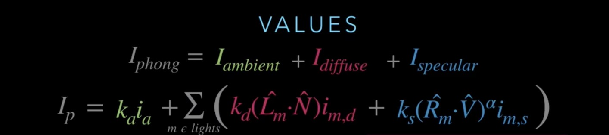
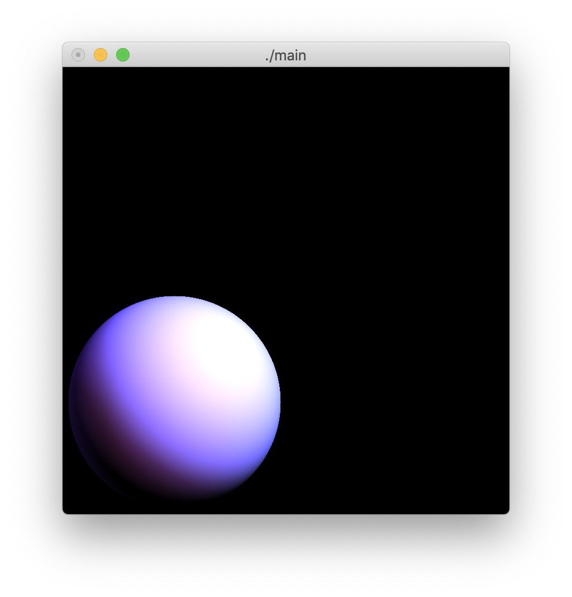
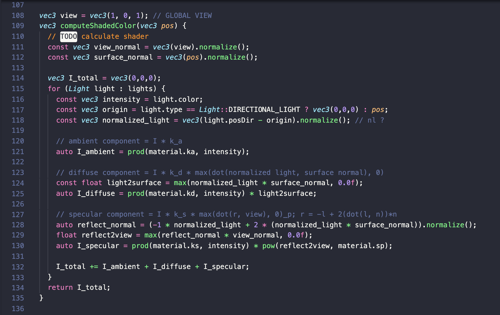

# Realtime CG HW1

## Screen shot

## Useful Resource

- full reference: [phong illumination model](https://andyzeng.github.io/basicshading)
- some code: [raw code but not same](https://github.com/emmiehe/basic-shading/blob/master/src/shading.cpp)
- another shader [Specular Reflections](https://www.scratchapixel.com/lessons/3d-basic-rendering/phong-shader-BRDF)

## HomeWork Instruction

ส่งภายใน 1 มีนาคม 2564 เวลา 13:00 น ที่ [nuttapong26@gmail.com](mailto:nuttapong26@gmail.com)
ใช้ Subject __Realtime CG HW1__ ภายใน email ระบุชื่อ นามสกุล รหัสนิสิต 
แนบ _main.cpp_ มา ใน email 
ต้องระบุว่าทำ extra credit อะไรเพิ่มบ้าง   

### For this assignment, you will write a program that: 
- Opens a window that contains an OpenGL rendering area. 
- Displays a circular shape that will be shaded using the _Phong Illumination Model_ for point and directional lights. 
- The circular shape should occupy most of the window. If the window is resized it should update the display so that the shape still occupies most of the window and is still round. 

### You program will take a series of command line options: 

- -ka r g b 
  
  This is the ambient color coefficients of the sphere material. The parameters r g b are numbers between 0 and 1 inclusive. 

- -kd r g b 
  
  This is the diffuse color coefficients of the sphere material. The parameters r g b are numbers between 0 and 1 inclusive. 

- -ks r g b 

  This is the specular color coefficients of the sphere material. The parameters r g b are numbers between 0 and 1 inclusive. 

- -sp v 

  This is the power coefficient on the specular term. It is a number between 0 and max_float. 

- -pl x y z r g b 

  This adds a point light to the scene. The x y z values are the location of the light. The r g b values are it's color. Note that the x y z values are relative to the sphere. That is, the center of the sphere is at the origin and the radius of the sphere defines one unit of length. The Y direction is UP, the X direction is to the right on the screen, and the Z direction is "in your face." The r g b value are between 0 and max_float, NOT between 0 and 1 (that is, the r g b values encode the brightness of the light). 

- -dl x y z r g b 

  This adds a directional light to the scene. The x y z values are the direction that the light points in. The r g b values are it's color. See -pl for coordinate system notes. There may be up to 5 point lights and 5 directional lights (10 total) in a scene. The r g b values of 1.0 should be mapped to a display values of 255. 
 
All command line arguments are optional. The default values should be a black sphere with no lights.The coordinate system you use in your program should have the sphere at the origin and the viewer looking down the Z-axis. The X-axis points to the right of the screen, the Yaxis points up, and the viewer is located in the positive Z direction 
 
### Optional features that you can implement for extra credit are: 
- [ ] Anisotropic diffuse or specular shading 
- [ ] Writing the image to a image file instead of to the screen. (Default would still be to the screen, but an optional command line argument would cause no OpenGL window to be open and file output instead.) The image format must be something commonly supported by most image viewers, for example JPEG, PNG, TIFF, or PPM. 
- [ ] Some sort of "toon" shading. 
- [ ] Other shapes besides spheres. 
- [ ] Multiple spheres. 
- [ ] Multiple spheres that can shadow each other. 

All features should be clearly documented in submission email. They should be implemented through additional command line options. The behavior of the arguments specified as required for the assignment should not be changed. (In other words your enhanced program must be fully backwards compatible with the original specification.) 
 
